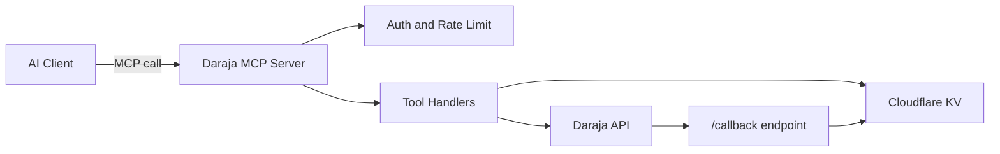

# Daraja MCP Server

[](https://dl.circleci.com/status-badge/redirect/gh/pmutua/cloudflare-daraja-mcp/tree/main)
[](https://codecov.io/github/pmutua/contact-form-cloudflare-worker)

Cloudflare Worker foundation for an MCP server that exposes Safaricom M-Pesa (Daraja) APIs as AI-callable tools.

## Start Here (Beginner Friendly)

If you are new to MCP, read this first:

- [docs/BEGINNER_GUIDE.md](docs/BEGINNER_GUIDE.md)
- [docs/ARCHITECTURE.md](docs/ARCHITECTURE.md)
- [docs/MCP_CONSUMERS.md](docs/MCP_CONSUMERS.md)

In simple terms, this project lets an AI assistant safely do common M-Pesa payment tasks through structured tools.

## What Is an MCP Server?

MCP (Model Context Protocol) is a standard way for AI assistants to call tools.

An MCP server is a service that:

1. defines tools with clear input/output rules
2. receives tool calls from AI clients
3. executes real business actions
4. returns structured responses

In this project, the tools are payment-focused actions like starting STK push and checking transaction status.

## Why This Server Is Useful

Without this server, teams often hardcode payment logic inside chatbot prompts or app glue code.

This server gives you:

1. reusable payment tools any MCP-compatible client can call
2. safer operations via API key auth and rate limits
3. reliable transaction traceability in KV logs
4. cleaner separation between AI behavior and payment infrastructure

## Typical Use Cases

1. AI customer support can trigger STK push after user confirmation.
2. AI checkout assistant can verify if a payment completed.
3. Operations assistant can explain Daraja error codes quickly.
4. Developers can simulate payment flows in sandbox without real charge.

## How It Works (High Level)

1. Your AI client sends a tool call to this server at `/mcp`.
2. The server validates auth and usage limits.
3. The selected tool runs Daraja API logic.
4. Results are returned as structured JSON for the AI client.
5. Callback updates and transaction metadata are stored in KV.

## Architecture Diagram



For full architecture, sequence diagrams, and examples, see [docs/ARCHITECTURE.md](docs/ARCHITECTURE.md).

For detailed setup across MCP consumers (VS Code, stdio-first hosts, and custom clients), see [docs/MCP_CONSUMERS.md](docs/MCP_CONSUMERS.md).

## Usage Examples

List tools:

```bash
curl -H "x-api-key: <your_api_key>" https://<your-domain>/mcp/tools
```

Health check:

```bash
curl https://<your-domain>/health
```

See end-to-end illustrations and tool input/output examples in [docs/ARCHITECTURE.md](docs/ARCHITECTURE.md).

## Quick Start in 5 Minutes

1. Install dependencies: `npm install`
2. Create local vars template: `npm run setup:local`
3. Fill real values in `.dev.vars`
4. Validate config: `npm run doctor`
5. Start local server: `npm run dev`
6. Check health: `GET /health`

If you want a strict config check that fails on missing required values, run: `npm run doctor -- --strict`

## Beginner Learning Links

Legend: Beginner = no prior MCP knowledge needed. Intermediate = some prior context helps.

MCP fundamentals:

- MCP introduction (Beginner, ~10 min): https://modelcontextprotocol.io/introduction
- MCP architecture concepts (Beginner, ~15 min): https://modelcontextprotocol.io/docs/learn/architecture
- MCP specification (Intermediate, ~20-30 min skim): https://spec.modelcontextprotocol.io/

Cloudflare basics for this project:

- Cloudflare Workers overview (Beginner, ~10 min): https://developers.cloudflare.com/workers/
- Wrangler CLI docs (Beginner, ~15 min): https://developers.cloudflare.com/workers/wrangler/
- Workers KV getting started (Beginner, ~15 min): https://developers.cloudflare.com/kv/get-started/
- Workers bindings overview (Intermediate, ~15 min): https://developers.cloudflare.com/workers/runtime-apis/bindings/

Daraja and M-Pesa docs:

- Safaricom developer portal (Beginner, ~5 min): https://developer.safaricom.co.ke/
- Daraja APIs catalog (Beginner, ~10 min): https://developer.safaricom.co.ke/apis
- Daraja Getting Started (Beginner, ~15 min): https://developer.safaricom.co.ke/apis/GettingStarted
- Daraja Authorization OAuth (Intermediate, ~10 min): https://developer.safaricom.co.ke/apis/Authorization

MCP clients and tooling:

- Use MCP servers in VS Code (Beginner, ~15 min): https://code.visualstudio.com/docs/copilot/chat/mcp-servers
- MCP configuration in VS Code (Intermediate, ~15 min): https://code.visualstudio.com/docs/copilot/reference/mcp-configuration

Diagrams and visuals:

- Mermaid intro (Beginner, ~10 min): https://mermaid.js.org/intro/
- Mermaid live editor (Beginner, hands-on): https://mermaid.live/edit

## Current Status

Implemented: **Commit 1 - Project Bootstrap**, **Commit 2 - MCP Server Setup**, **Commit 3 - API Key Auth**, **Commit 4 - Rate Limiting (KV)**, **Commit 5 - OAuth Token (Daraja)**, **Commit 6 - STK Push**, **Commit 7 - Transaction Status**, **Commit 8 - Payment Verification Layer**, **Commit 9 - Callback Handler**, **Commit 10 - Simulation Tool**, **Commit 11 - Error Intelligence**, **Commit 12 - Workers AI Integration**, **Commit 13 - Logging + Observability**, **Commit 14 - Agents Integration (Future)**

- Cloudflare Worker project scaffold
- Basic `fetch` handler
- Health endpoint: `GET /health`
- MCP SDK integrated (`@modelcontextprotocol/sdk`)
- MCP server configured as `daraja-mcp-server` v`1.0.0`
- Basic tool registration with initial `get_usage_status` tool
- MCP transport endpoint: `/mcp`
- Tool discovery endpoint: `GET /mcp/tools`
- API key auth middleware for protected routes via `x-api-key`
- KV-backed daily rate limiting middleware (`USAGE` namespace)
- Request limit: `50` requests per UTC day
- Daraja OAuth token tool: `get_access_token`
- Token caching in KV (`TOKENS` namespace)
- STK Push tool: `stk_push`
- Daraja STK password generation: `Base64(shortCode + passkey + timestamp)`
- STK request/response logging in KV (`TRANSACTIONS` namespace)
- Transaction status tool: `check_transaction_status`
- Normalized response fields: `status`, `resultCode`, `responseCode`, `isComplete`
- Payment verification tool: `verify_payment_intent`
- Verification checks: amount matching and optional phone matching
- Callback endpoint: `POST /callback`
- Callback payload storage in KV (`CALLBACKS` namespace)
- Development simulation tool: `simulate_payment` (no external API calls)
- Daraja error explanation tool: `explain_error_code`
- Transaction log summary tool: `summarize_transaction_logs`
- Optional Workers AI enhancement for natural language summaries
- Structured request and error logging utilities
- `DEBUG_MODE=true` enables request/error log emission
- Orchestration planning tool: `orchestrate_payment_workflow`
- Provides agent-to-agent payment workflow plans for future Cloudflare Agents runtime

## Authentication

- Protected routes require header: `x-api-key: <your_api_key>`
- Public route: `GET /health`

Set API key secret before deploy:

```bash
wrangler secret put API_KEY
```

## Rate Limiting (KV)

Create a KV namespace and bind it as `USAGE` in your `wrangler.toml`:

```toml
[[kv_namespaces]]
binding = "USAGE"
id = "<your-usage-kv-namespace-id>"
preview_id = "<your-usage-kv-preview-id>"
```

If the daily quota is exhausted, protected endpoints return `429`.

## Daraja OAuth

Required secrets:

```bash
wrangler secret put DARAJA_CONSUMER_KEY
wrangler secret put DARAJA_CONSUMER_SECRET
```

Optional secrets/vars:

- `DARAJA_ENV` = `sandbox` (default) or `production`
- `DARAJA_BASE_URL` = custom override for Daraja base URL

Add token cache KV binding in `wrangler.toml`:

```toml
[[kv_namespaces]]
binding = "TOKENS"
id = "<your-tokens-kv-namespace-id>"
preview_id = "<your-tokens-kv-preview-id>"
```

## STK Push

Required configuration:

```bash
wrangler secret put DARAJA_SHORTCODE
wrangler secret put DARAJA_PASSKEY
wrangler secret put DARAJA_CALLBACK_URL
```

Important notes:

- A callback endpoint is required for end-to-end STK flow because final payment outcomes are sent asynchronously by Daraja.
- This server already implements the callback route at POST /callback.
- Set DARAJA_CALLBACK_URL to a real public HTTPS URL, for example https://<your-worker-domain>/callback.
- For sandbox, use the Lipa Na M-Pesa Online passkey for shortcode 174379. Do not use Security Credential for STK password generation.
- STK password formula is Base64(shortCode + passkey + timestamp), where timestamp format is YYYYMMDDHHmmss.

Optional:

- `DARAJA_TRANSACTION_TYPE` = `CustomerPayBillOnline` (default) or `CustomerBuyGoodsOnline`

Add transaction log KV binding in `wrangler.toml`:

```toml
[[kv_namespaces]]
binding = "TRANSACTIONS"
id = "<your-transactions-kv-namespace-id>"
preview_id = "<your-transactions-kv-preview-id>"
```

`stk_push` input fields:

- `amount`
- `phoneNumber`
- `accountReference`
- `transactionDesc`
- `callbackUrl` (optional override)
- `transactionType` (optional override)

Set your Daraja callback to this endpoint:

- `https://<your-worker-domain>/callback`

The callback endpoint stays unauthenticated by design so Safaricom can deliver payment updates.

Add callback storage KV binding in `wrangler.toml`:

```toml
[[kv_namespaces]]
binding = "CALLBACKS"
id = "<your-callbacks-kv-namespace-id>"
preview_id = "<your-callbacks-kv-preview-id>"
```

## Run Locally

Quick local setup:

```bash
npm run setup:local
npm install
npm run doctor
```

The doctor command checks required Daraja and API key variables before starting the worker.
Use `npm run doctor -- --strict` when you want missing required keys to fail fast.

```bash
npm install
npm run dev
```

## Test (TDD)

```bash
npm test
```

## Test Coverage Report

Install coverage tooling (if starting from a minimal setup):

```bash
npm install --save-dev vitest @vitest/coverage-v8
```

Generate coverage output:

```bash
npx vitest run --coverage
```

Generate and refresh coverage report in README:

```bash
npm run coverage:update
```

<!-- coverage-report:start -->
Last updated: 2026-03-22T00:35:43.569Z

| Metric | Coverage | Covered | Total |
| --- | ---: | ---: | ---: |
| Statements | 80.69% | 347 | 430 |
| Branches | 61.98% | 225 | 363 |
| Functions | 84.50% | 60 | 71 |
| Lines | 80.42% | 337 | 419 |

Refresh with: `npm run coverage:update`
<!-- coverage-report:end -->

## Codecov CLI Upload (Manual, Local OS)

Codecov upload is intentionally done outside CircleCI in this repository.

Best method for this project: manual local upload after coverage generation, to keep CI lean and avoid token handling in pipeline jobs.

If you later choose CI-based upload, use the same verified CLI flow in your CI runner and keep `CODECOV_TOKEN` only in CI secrets.

Recommended flow:

1. Generate coverage: `npx vitest run --coverage`
2. Verify and install Codecov CLI for your OS
3. Upload with token:

```bash
./codecov upload-process -t "$CODECOV_TOKEN" -f coverage/coverage-final.json -F vitest
```

Windows (PowerShell):

```powershell
$ProgressPreference = 'SilentlyContinue'
Invoke-WebRequest -Uri https://keybase.io/codecovsecurity/pgp_keys.asc -OutFile codecov.asc
gpg.exe --import codecov.asc

Invoke-WebRequest -Uri https://cli.codecov.io/latest/windows/codecov.exe -OutFile codecov.exe
Invoke-WebRequest -Uri https://cli.codecov.io/latest/windows/codecov.exe.SHA256SUM -OutFile codecov.exe.SHA256SUM
Invoke-WebRequest -Uri https://cli.codecov.io/latest/windows/codecov.exe.SHA256SUM.sig -OutFile codecov.exe.SHA256SUM.sig

gpg.exe --verify codecov.exe.SHA256SUM.sig codecov.exe.SHA256SUM
if ((Compare-Object -ReferenceObject ((($(certUtil -hashfile codecov.exe SHA256)[1]), 'codecov.exe') -join '  ') -DifferenceObject (Get-Content codecov.exe.SHA256SUM)).Length -eq 0) {
  Write-Output 'SHASUM verified'
} else {
  exit 1
}

.\codecov.exe upload-process -t "$env:CODECOV_TOKEN" -f coverage/coverage-final.json -F vitest
```

Linux:

```bash
curl https://keybase.io/codecovsecurity/pgp_keys.asc | gpg --no-default-keyring --keyring trustedkeys.gpg --import
curl -Os https://cli.codecov.io/latest/linux/codecov
curl -Os https://cli.codecov.io/latest/linux/codecov.SHA256SUM
curl -Os https://cli.codecov.io/latest/linux/codecov.SHA256SUM.sig
gpg --verify codecov.SHA256SUM.sig codecov.SHA256SUM
shasum -a 256 -c codecov.SHA256SUM
sudo chmod +x codecov
./codecov upload-process -t "$CODECOV_TOKEN" -f coverage/coverage-final.json -F vitest
```

macOS:

```bash
curl https://keybase.io/codecovsecurity/pgp_keys.asc | gpg --no-default-keyring --keyring trustedkeys.gpg --import
curl -Os https://cli.codecov.io/latest/macos/codecov
curl -Os https://cli.codecov.io/latest/macos/codecov.SHA256SUM
curl -Os https://cli.codecov.io/latest/macos/codecov.SHA256SUM.sig
gpg --verify codecov.SHA256SUM.sig codecov.SHA256SUM
shasum -a 256 -c codecov.SHA256SUM
sudo chmod +x codecov
./codecov upload-process -t "$CODECOV_TOKEN" -f coverage/coverage-final.json -F vitest
```

## CircleCI CI/CD

This repository now includes CircleCI pipeline config at `.circleci/config.yml`.

Pipeline behavior:

- CI on branches and tags:
  - `npm run check`
  - `npm test`
  - `npm run test:e2e`
  - `npm run test:coverage`
  - coverage artifacts stored in CircleCI
- CD to sandbox on `main` branch.
- Production deployment is intentionally disabled in CircleCI.
- Smoke tests are currently disabled in the workflow.

Required CircleCI environment variables:

- `CLOUDFLARE_API_TOKEN`
- `CLOUDFLARE_ACCOUNT_ID`

Required runtime secret variables for sandbox deploy (auto-synced to Worker secrets):

- `SANDBOX_API_KEY` -> `API_KEY`
- `SANDBOX_DARAJA_CONSUMER_KEY` -> `DARAJA_CONSUMER_KEY`
- `SANDBOX_DARAJA_CONSUMER_SECRET` -> `DARAJA_CONSUMER_SECRET`
- `SANDBOX_DARAJA_SHORTCODE` -> `DARAJA_SHORTCODE`
- `SANDBOX_DARAJA_PASSKEY` -> `DARAJA_PASSKEY`
- `SANDBOX_DARAJA_CALLBACK_URL` -> `DARAJA_CALLBACK_URL`

Optional sandbox runtime variables:

- `SANDBOX_DARAJA_ENV` -> `DARAJA_ENV`
- `SANDBOX_DARAJA_BASE_URL` -> `DARAJA_BASE_URL`
- `SANDBOX_DARAJA_TRANSACTION_TYPE` -> `DARAJA_TRANSACTION_TYPE`

Coverage upload to Codecov is intentionally not run in CircleCI.
Use the "Codecov CLI Upload (Manual, Local OS)" section above.

## Pre-commit Hook

This repository uses Husky pre-commit hooks.

- Hook file: `.husky/pre-commit`
- Runs before each commit:
  - `npm run check`
  - `npm test`

## Deploy

```bash
npm run deploy
```

## Release Runbook

Use the production checklist in [docs/RELEASE_RUNBOOK.md](docs/RELEASE_RUNBOOK.md) for:

- pre-release validation (`npm run check`, tests, Terraform validate)
- Cloudflare secrets and bindings verification
- deployment sequence (`terraform apply` and `npm run deploy`)
- post-deploy smoke tests for `/health`, `/mcp/tools`, and callback routing

Release governance documents:

- [CHANGELOG.md](CHANGELOG.md)
- [docs/VERSIONING.md](docs/VERSIONING.md)

## Health Check Response

`GET /health`

```json
{
  "ok": true,
  "service": "daraja-mcp-server",
  "status": "healthy",
  "timestamp": "2026-03-22T00:00:00.000Z"
}
```
