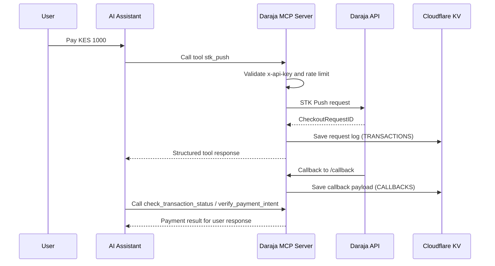

# Architecture and Usage Illustrations

This document explains the system architecture visually and shows practical usage examples.

## 1. System Architecture (High Level)

```mermaid
flowchart LR
    A[AI Client or MCP Host\nCopilot, Agent, or App] -->|MCP tool call| B[Daraja MCP Server\nCloudflare Worker]
    B --> C{Security and Control Layer}
    C -->|API key check| D[Protected MCP routes]
    C -->|daily quota check| D
    B --> E[Tool Runtime\nget_access_token, stk_push, status, verify]
    E --> F[Safaricom Daraja APIs]
    E --> G[Cloudflare KV]
    G --> G1[USAGE]
    G --> G2[TOKENS]
    G --> G3[TRANSACTIONS]
    G --> G4[CALLBACKS]
    F -->|payment callback| H[/callback endpoint]
    H --> G4
```

## 2. Request Flow (Sequence)



## 3. Core Components

1. HTTP entrypoint in [src/index.ts](../src/index.ts) handles routing, auth, and rate limiting.
2. MCP tool definitions in [src/mcp.ts](../src/mcp.ts) expose payment actions to AI clients.
3. Daraja business logic in [src/daraja.ts](../src/daraja.ts) handles OAuth, STK, status, and verification.
4. Callback processing in [src/callback.ts](../src/callback.ts) stores callback payloads safely.
5. Observability utilities in [src/observability.ts](../src/observability.ts) mask sensitive fields.

## 4. How to Use This MCP Server

### Option A: Through an MCP-compatible AI client

1. Configure your MCP client to point to this server's `/mcp` endpoint.
2. Provide `x-api-key` in request headers.
3. Discover tools using `/mcp/tools`.
4. Let the AI call tools such as `stk_push` and `verify_payment_intent`.

### Option B: Through direct HTTP for diagnostics

Use direct endpoints for validation and operations checks.

```bash
curl https://<your-domain>/health
```

```bash
curl -H "x-api-key: <your_api_key>" https://<your-domain>/mcp/tools
```

## 5. Example Tool Inputs and Outputs

### Example 1: Start STK Push

Input shape:

```json
{
  "amount": 100,
  "phoneNumber": "254712345678",
  "accountReference": "ORDER-1001",
  "transactionDesc": "Order payment"
}
```

Typical outcome fields include:

```json
{
  "MerchantRequestID": "...",
  "CheckoutRequestID": "...",
  "ResponseCode": "0",
  "ResponseDescription": "Success. Request accepted for processing"
}
```

### Example 2: Verify Payment Intent

Input shape:

```json
{
  "checkoutRequestId": "ws_CO_123456789",
  "expectedAmount": 100,
  "expectedPhoneNumber": "254712345678"
}
```

Typical verification response:

```json
{
  "state": "verified",
  "verified": true,
  "amountMatch": "match",
  "phoneMatch": "match"
}
```

### Example 3: Explain Daraja Error

Input shape:

```json
{
  "code": 1032
}
```

Typical explanation response:

```json
{
  "found": true,
  "code": 1032,
  "category": "user_action",
  "nextAction": "Notify customer and retry when they are ready."
}
```

## 6. Beginner Notes

1. `/health` is for uptime checks.
2. `/callback` must stay unauthenticated for Safaricom callback delivery.
3. All other business routes are protected by `x-api-key`.
4. Start in sandbox before moving to production.
